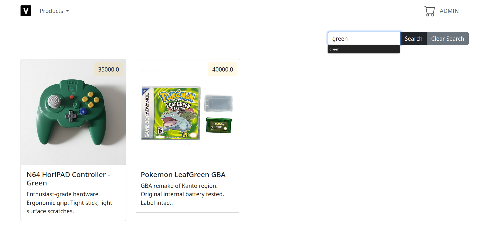
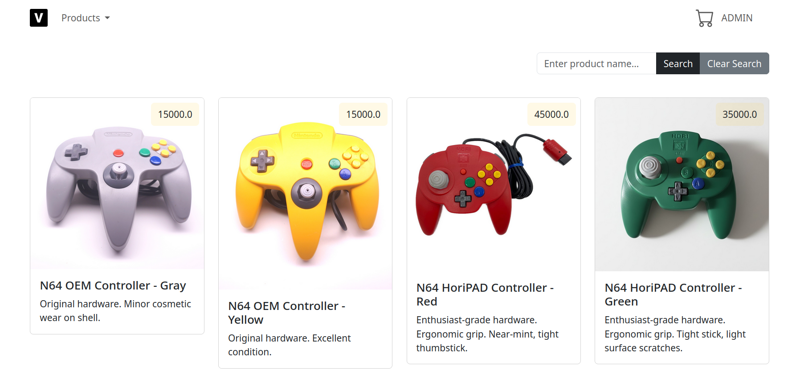
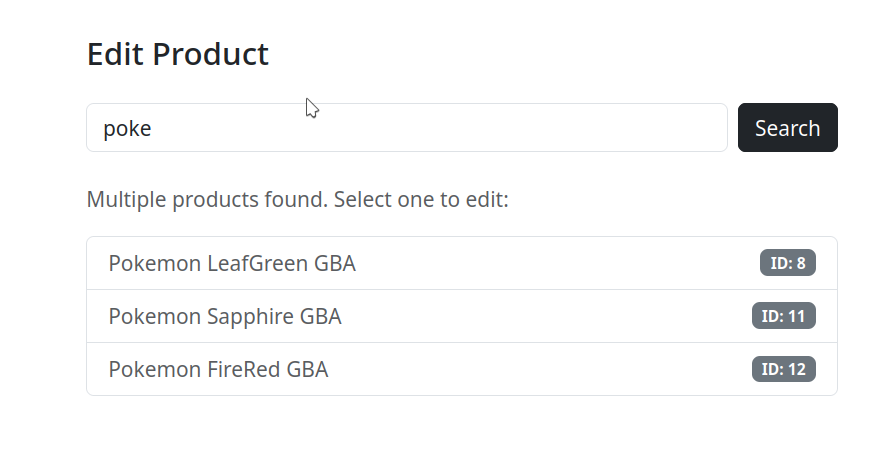

# E-commerce product admin editor

Front-end connection with backend mock-up for editing products for ecommerce

For correct usage add your user and password in [database.properties](./src/main/resources/database.properties), since it contains a throwaway password i use in one of my configurations for mariaDB.

# Instructions for usage

    1. Clone this repository   
    2. Create database called ecommerce_sql with schema.sql and feed feed.sql to it
    3. Run ./startup.sh on your tomcat folder
    4. Import the project in Intellij, export the war and add it to your Tomcat Manager
    5. Click any of the Products dropdown menu options for testing

# Screenshots

    
    
    

# Considerations
For a real proper usage, add the img of your new product to assets and name it as the id of the new product, since this mock-up lacks proper file upload to the repository

## Acknowledgements

 - [Awesome README](https://github.com/matiassingers/awesome-readme)
 - LLM usage for formatting and redudancy check on .jsps (I'm against usage of LLMs for educational and serious projects, if its used by me it's done for rubber duck purposes or re-checking typos in specific scenarios)

 [link to repository](https://github.com/sebastianaste/ecommerce-m5)

